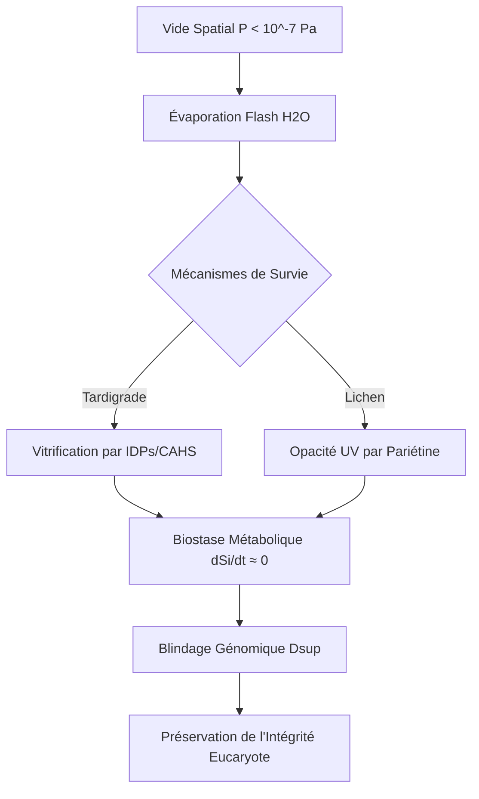

# 🧬 Protocole Ouellette : Bio-Mimetic Space Survival Engine


## 🎯 Synopsis
Le **Protocole Ouellette** déconstruit les mécanismes physico-chimiques permettant aux lichens (*Xanthoria elegans*) et aux tardigrades (*Ramazzottius varieornatus*) de persister dans le vide extrême de l'espace. Contrairement aux approches de résistance active, ce protocole propose une stratégie de **défaillance contrôlée** vers un état de stabilité thermodynamique supérieure : la **Biostase ($\Psi_B$)**.

Ce dépôt fournit le formalisme nécessaire pour transposer la vitrification cytoplasmique et le blindage génomique électrostatique aux applications humaines et technologiques.

---

## 📐 Formalisme Mathématique

### 1. Atténuation Photonique Corticale (Lichen-Mimicry)
L'atténuation des flux UV par le cortex biologique est modélisée par une extension de la loi de Beer-Lambert, intégrant la diffusion cristalline de la pariétine :

$$I(\lambda, z) = I_0(\lambda) \exp\left( - \sum_{i} (\epsilon_i(\lambda) \cdot c_i \cdot z) - S(\lambda, z) \right)$$

Où :
* $I(\lambda, z)$ : Intensité spectrale à la profondeur $z$.
* $\epsilon_i(\lambda)$ : Coefficient d'extinction molaire du métabolite (pariétine).
* $S(\lambda, z)$ : Facteur de dispersion lié à la porosité cristalline.

### 2. Transition Vitreuse (Gordon-Taylor)
La stabilité de l'état vitreux (biostase) dépend de la fraction massique d'eau résiduelle $w_2$ et de la température de transition vitreuse $T_g$ des protéines CAHS :

$$T_g(\text{mélange}) = \frac{w_1 T_{g1} + k w_2 T_{g2}}{w_1 + k w_2}$$

Où $T_{g1}$ (soluté anhydre) $\approx 98^\circ\text{C}$ pour les protéines CAHS, garantissant une vitrification stable même sous contrainte thermique martienne.

---

## 🔗 Architecture Causale du Système



---

## 🔬 Prédictions & Métrologie (Benchmarks)

| Paramètre | Cible (Humain/Matériau) | Source Bio-Inspirée | Impact |
| --- | --- | --- | --- |
| **Radioprotection** | Réduction 50% cassures ADN | Protéine Dsup | Haute |
| **Stabilité Thermique** |  | Protéines CAHS | Critique |
| **Filtration UV** |  (UVC/UVB) | Pariétine | Maximale |

---

## 🚀 Roadmap des Applications

### 🔹 Court Terme (1-5 ans) : Stabilisation de Vaccins

Utilisation de mélanges tréhalose-CAHS pour supprimer la chaîne du froid (stabilité à  au lieu de ).

### 🔸 Moyen Terme (5-10 ans) : Radiothérapie Transitoire

Livraison d'ARNm de Dsup via nanoparticules lipidiques pour protéger les tissus sains lors du traitement de tumeurs.

### 🌌 Long Terme (15+ ans) : Habitats Auto-Croissants

Impression 3D de structures en régolithe martien consolidé par biosystèmes lichénisés (symbiose fongique/cyanobactérienne).

---

## ⚠️ Limitations & Éthique

* **Neurotoxicité** : L'expression de Dsup doit être régulée pour éviter une condensation anormale de la chromatine neuronale.
* **Protection Planétaire** : Risque de contamination irréversible des biosphères extra-terrestres par des châssis génétiques terrestres ultra-résilients.

---

**Auteur :** Dr. Bryan Ouellette

**Laboratoire :** Protocole Ouellette - Ingénierie de la Résilience Moléculaire

```
